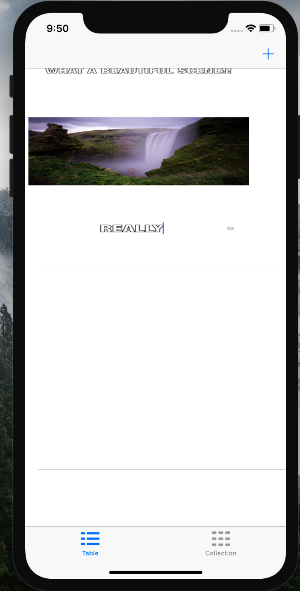
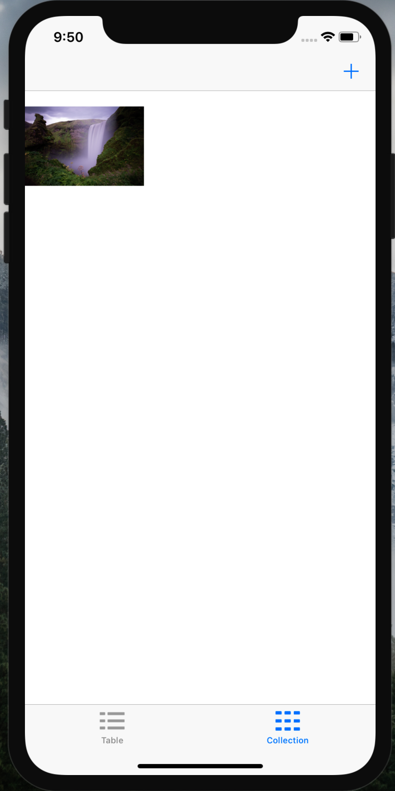
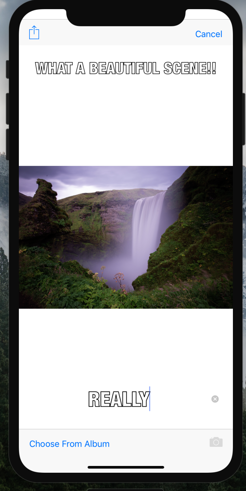

# Meme App

## Prerequisites
- IOS Running Device
- Simulator on MacOS
- Xcode 9.0 and Above
- Swift 4

## Theory
- The main objective of this project was to record the create memes by adding text on the images either uploaded from Gallery or by clicking new ones. 
- The text could be either added on the top or bottom of the meme. 
- This meme could further be saved to your device. 
- The saved memes could be seen in both table view or collection view as shown in the pics bellow.
- It was build for iOS devices. 

## How To Run It
- Download this Project on your Mac
- Open This Project Folder
- Open the Pitch Perfect.xcodeproj
- Just Build It and Run it

#### Following are some of the screenshots of the application : 
- 
- 
- 

